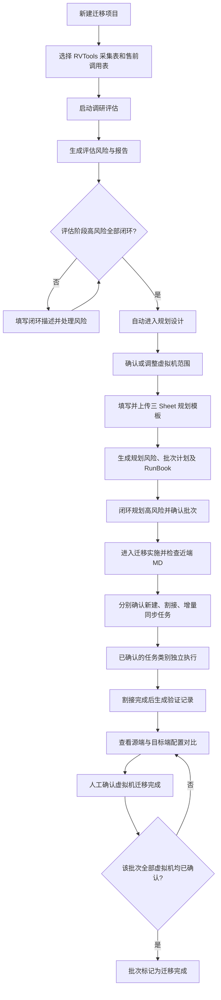

# Migration Agent 项目业务逻辑说明

> 整理日期：2026-09-12。依据当前项目源码梳理，重点说明业务流程、操作条件、数据流转及实现边界。本文没有修改或补充项目业务功能。

## 1. 项目定位

Migration Agent 是一个面向迁移交付人员的工作台原型，将迁移项目组织为 **调研评估、规划设计、迁移实施、结果验证** 四个阶段，通过交互智能体引导用户提交资料、处理风险、确认计划、批准执行并完成验收。

核心业务链路是：**以项目建档为起点，以风险闭环和人工确认为推进条件，以虚拟机及批次的迁移验收为结果。**

当前主页面围绕虚拟机迁移展开，演示的源端为 VMware，目标端为 FusionCompute，近端执行工具称为 MigrationDirector（简称 MD）。建档时虽然也能选择 SAN、NAS、对象迁移，但代码没有为这些类型实现独立业务流程。

**当前版本属于浏览器内的交互演示。** 项目数据保存在 React 内存状态中；文件内容不解析、不上传；评估、规划、MD 检查和执行进度由固定数据与计时器模拟，没有接入真实智能体或迁移服务。

## 2. 业务角色与操作入口

| 角色或模块 | 业务职责 | 当前实现方式 |
| --- | --- | --- |
| 项目经理 / 迁移交付人员 | 建档、提供资料、确认范围与批次、关闭风险、批准任务、人工验收 | 同一用户在页面中完成全部操作，未实现角色权限划分 |
| 交互智能体 | 引导下一步操作，展示用户操作与系统事件，回答简单问题 | 页面内消息列表和固定回复规则 |
| 评估子智能体 | 形成资产范围、风险及评估报告 | 延时生成预设风险和报告 |
| 规划子智能体 | 收集业务信息、依赖与约束，生成批次计划及 RunBook | 固定分批规则和文档模板 |
| 实施子智能体 | 引导 MD 检查，组织三类任务确认与执行 | 固定检查步骤、独立审批标记和模拟队列 |
| 验证子智能体 | 展示源端与目标端配置对比，等待人工验收 | 生成配置相同的源端与目标端数据 |

页面入口包括：当前项目、新建项目、四阶段卡片、交互窗口，以及“交付风险”“任务管理”“生成项目日报”。当前项目菜单只有新建入口，没有历史项目列表或多项目切换能力。

## 3. 主业务流程

下图描述正常操作路径；部分入口的阶段校验尚未统一，详见第 11 节。

三类实施任务可以分别批准，任意一类确认后立即执行，无需等待其他两类批准。进入结果验证的自动触发条件是割接队列完成，不是三类队列全部完成。

## 4. 项目建档与调研评估

### 4.1 项目建档

| 字段 | 可选值或填写规则 |
| --- | --- |
| 行业 | 金融、运营商、公安、政府、教育；默认金融 |
| 地区部 | 中国地区部、中亚地区部、亚太地区部；默认中国地区部 |
| 代表处 | 文本输入，去除首尾空白后不能为空 |
| 局点名称 | 文本输入，去除首尾空白后不能为空；作为页面项目名称 |
| 迁移类型 | 虚拟化、SAN、NAS、对象；默认虚拟化 |

创建成功后，当前阶段设为调研评估，清空文件记录、风险、批次、任务、MD 历史、审批和验收状态，虚拟机数量恢复为 128 台。

当前只保存一个项目对象。再次建档会替换当前项目的业务状态，但原有聊天消息不会一并清空。刷新页面后，项目及业务状态不会恢复。

### 4.2 资料准备与评估启动

评估需要两类输入：

1. **RVTools 采集表**：业务上用于提供虚拟机与资源采集信息。
2. **售前调用表**：业务上用于提供售前信息、容量基线及约束。

文件选择器接受 `.xlsx`、`.xls`、`.csv`。两份文件均已选择后，评估状态变为“就绪”。没有项目时点击“启动评估”会打开建档流程；资料不齐时会提示补齐；评估完成后再次启动会提示已完成。

评估启动后显示处理中，约 1.6 秒后生成固定的 4 项风险及评估报告：

| 风险示例 | 等级 | 初始状态 |
| --- | --- | --- |
| ESXi 主机 CPU 指令集与目标平台不兼容 | 高 | 未闭环 |
| 缺少核心业务峰值 IOPS 与时延基线 | 高 | 未闭环 |
| NAS ACL 映射与目标端权限模型存在差异 | 中 | 未闭环 |
| 对象存储 SDK 版本兼容问题 | 低 | 已闭环 |

报告包含项目名称、行业、迁移类型、风险数量、高风险未闭环数量和阶段推进结论，以 `.txt` 下载。

### 4.3 评估阶段的退出条件

用户需在风险面板填写闭环说明并逐项确认。**最后一项评估高风险关闭时，系统自动进入规划设计，规划状态变为“待确认范围”。** 中、低风险不阻塞该正常推进路径。

上传处理实际只保存文件名；页面中的“格式检查通过”“解析资产清单”等消息均为演示文案，不代表已读取文件或执行评估算法。

## 5. 规划设计

### 5.1 确认迁移范围

初始生成 128 台虚拟机的范围清单，字段包括虚拟机名称、IP 地址、vCPU、内存和资源池。用户可以：

- 下载范围清单，直接点击确认，保留 128 台。
- 选择调整后的范围文件，系统将数量固定改为 124 台，并直接进入规划信息补充步骤。

后一条是模拟规则：系统没有读取被删除的虚拟机，而是根据新的数量重新生成列表。

### 5.2 补充规划信息

规划模板包含三个工作表：

| 工作表 | 需要补充的业务信息 |
| --- | --- |
| 虚拟机清单 | 业务系统名称、业务等级、集群类型、集群角色；附带虚拟机名称和 IP |
| 业务依赖关系 | 源业务系统、目标业务系统、依赖类型、依赖端口、依赖说明 |
| 迁移约束条件 | 约束对象、约束类型、约束描述、允许迁移窗口、回退要求 |

用户选择已填写的 `.xlsx` 或 `.xls` 后，进入“生成中”；约 1.6 秒后生成批次任务、4 项规划风险、实施计划和 RunBook。文件内容与工作表完整性没有被实际校验。

### 5.3 批次生成规则

当前固定生成 8 个批次，按虚拟机列表顺序切分，每批最多 16 台。默认 128 台时每批 16 台；范围为 124 台时，最后一批为 12 台。

| 批次 | 批次阶段 | 阶段类型 | 固定开始日期 | 持续天数 |
| --- | --- | --- | --- | --- |
| B-001 | 试点 | 全量同步 | 2026-09-07 | 3 |
| B-002 | 攻坚 | 增量同步 | 2026-09-09 | 3 |
| B-003 | 攻坚 | 全量同步 | 2026-09-11 | 3 |
| B-004 | 攻坚 | 割接验证 | 2026-09-13 | 2 |
| B-005 | 扩展 | 增量同步 | 2026-09-15 | 3 |
| B-006 | 扩展 | 全量同步 | 2026-09-17 | 3 |
| B-007 | 扩展 | 割接验证 | 2026-09-19 | 2 |
| B-008 | 扩展 | 验证 | 2026-09-21 | 1 |

结束日期按“开始日期 + 持续天数 − 1”计算。批次间未执行依赖关系分析、窗口冲突检测或资源容量调度，上述日期也不随当天日期变化。

规划风险包括：RAC 集群跨批次迁移的高风险，以及迁移窗口缺失、依赖验证记录缺失、资源池冗余不足等中低风险。

### 5.4 规划确认与交付物

规划完成后可以下载：

- **迁移批次与实施计划**：列出批次、虚拟机、类型、日期、执行负责人和状态。
- **RunBook**：包括项目范围、健康检查、停机确认、快照与回退点、数据同步、迁移验证、验收及回退原则。

用户可选择“需要调整”，在聊天框描述批次、虚拟机或日期；当前仅返回固定回复并恢复“待确认”状态，**不会修改批次或重新计算排期**。

点击“批次无误，进入迁移实施”时，系统检查规划阶段是否仍有未闭环高风险。通过后记录批次已确认，切换到迁移实施并初始化 MD 准备流程。

## 6. 迁移实施

### 6.1 MD 连接与配置准备

页面展示固定的服务端地址、端口及项目 ID，引导用户在近端 MD 中配置。点击检查后依次展示：

1. 服务端连接、心跳与项目身份检查。
2. 源端 VMware 发现配置检查。
3. 目标端 FusionCompute 资源及保护配置检查。
4. 源端与目标端端口组映射检查。
5. MD 就绪，开放实施任务查看与确认。

检查历史记录时间、标题和说明。当前检查全部按固定延时成功，总计约 2.2 秒；页面明确说明不会连接真实 MD，也没有失败、超时或重连分支。

### 6.2 三类实施任务

| 任务类别 | 当前生成范围 | 用户操作 | 状态变化 |
| --- | --- | --- | --- |
| 待新建任务 | 所有批次虚拟机展开后的前 12 台 | 配置任务、确认参数、批量创建；另有类别执行确认 | 任务明细：待配置 → 已确认 → 已创建 |
| 待割接任务 | 第一个“割接验证”批次，即 B-004，默认 16 台 | 查看、筛选、勾选、割接前检查、发起割接、确认割接完成 | 队列完成或人工确认后生成验证记录 |
| 待增量同步任务 | 总数固定为 8，展示所有批次展开后的前 8 条虚拟机记录 | 查看快照、目标 IP、数据量、计划窗口并确认执行 | 根据模拟完成数量显示待执行、运行中、已完成 |

“今日”任务没有按系统日期筛选。增量同步列表也未按批次的“增量同步”类型过滤。

### 6.3 新建任务配置

单个任务配置分三步：

1. **任务配置**：查看源端主机、虚拟机、操作系统和检查结果；编辑任务名称、固件等。
2. **目的 VM 与网络配置**：配置名称、计算资源、操作系统、CPU、内存、磁盘、显卡、端口组及高级选项。
3. **确认信息**：检查汇总内容，确认后将任务标记为“已确认”。

也可直接批量确认所选待配置任务。全部任务已确认后，才允许在此面板“批量创建任务”；创建后标记为“已创建”，并停止提供修改入口。

当前计算资源、端口组、延迟分配、保留 UUID 等部分选项仅保存在面板状态中，没有完整写入任务对象。主面板的“确认并立即执行”与这里的“全部确认后批量创建”属于两条独立状态路径，前者未检查逐台参数是否确认。

### 6.4 独立批准与模拟执行

三类任务各有独立的批准标记。批准某一类后，该类别立即启动，其他类别仍可继续查看和确认。

执行统计包含任务总数、已完成数、排队数和运行数。当前模拟规则为：

- 每 1.4 秒，每个已批准且未完成的类别增加 1 个完成任务。
- 剩余任务中最多显示 2 个运行，其余显示排队。
- 完成比例为“已完成数 ÷ 总数”。
- 没有真实调度、传输、失败重试、异常处理或回退执行。

队列统计与新建任务明细状态分开维护：队列计数完成不代表明细自动变成“已创建”。

## 7. 结果验证与验收

### 7.1 验证记录的来源

存在两条触发路径：

- **自动路径**：割接队列每新增完成数量，就生成相应虚拟机的验证记录；割接队列全部完成且当前处于迁移实施时，自动切换到结果验证。
- **人工路径**：在割接列表勾选任务，点击“确认割接完成并进入验证”，立即为所选任务生成验证记录并打开验证面板。该按钮没有校验所选任务的同步状态，也未要求三类任务均已批准。

人工路径不会同步更新割接队列完成数，因此两条路径的统计可能不同。

### 7.2 对比与确认

验证列表及详情展示批次、虚拟机、UUID、操作系统、对比结果和人工确认状态，其中 UUID 在详情中查看。列表支持搜索、状态筛选、单条确认与批量确认入口。

详情包含五组、共 25 项配置：

| 配置组 | 对比内容 |
| --- | --- |
| CPU | 核数、预留值、资源份额、上限、热插拔 |
| 内存 | 大小、预留值、资源份额、热插拔 |
| 磁盘 | 总线类型、槽位、大小、类型 |
| 网络 | IP、MAC、总线编号、路由、IO 环、队列数、Poll 加速、DNS、网关、TCP/IP 协议栈 |
| 显卡 | 类型、显存大小 |

页面只允许对“配置一致且尚未确认”的记录进行人工确认。当前源端配置生成后直接复制为目标端配置，对比结果固定为“一致”，没有执行真实配置采集或比较，也没有业务可用性、应用回归或数据完整性验证。

### 7.3 完成判定

- **虚拟机完成**：人工确认后，将对应验证记录标记为已确认，页面显示迁移完成。
- **批次完成**：该批次进入验证的记录数量等于规划虚拟机数量，且所有记录均已确认，才把批次编号加入“已完成批次”。
- **验证阶段卡片完成**：当前已有验证记录且这些记录全部确认时，显示 100%。这不等于全部规划批次或整个项目完成。

当前自动路径只覆盖第一个割接验证批次，尚未实现全部 8 个批次的持续执行、逐批验收和项目终验归档。

## 8. 跨阶段业务模块

### 8.1 风险管理

风险台账记录编号、描述、等级、所属阶段、关联批次、虚拟机名称及 ID、闭环状态、闭环说明和时间。支持按关键词和高、中、低等级筛选。

闭环时需要填写非空说明，输入框最多 300 字；提交后记录闭环状态与当前时间，并写入系统消息。当前未实现风险新增、重新打开、责任人分配或闭环证据附件。

正常主流程以当前阶段未闭环高风险作为阻塞条件；项目健康度则根据全局高风险显示“有风险”或“良好”。健康度条的 45% / 78% 为固定展示值，不是评估模型计算结果。

### 8.2 任务管理

任务管理提供两个层级：

- **迁移批次**：按试点、攻坚、扩展筛选；展示日期、虚拟机范围和批次状态；可生成甘特图并从批次进入虚拟机清单。
- **迁移任务**：按批次、名称、编号、目标 IP、是否创建筛选；下钻查看虚拟机信息、关联风险或全量同步、增量同步、割接验证、结果验证四类明细。

新建任务状态通过虚拟机名称关联，未使用稳定的源端/目标端独立标识。迁移状态、进度、速率和部分风险关联根据预设规则生成。

同步、暂停、删除、定时同步、日志下载、取消定时同步等按钮当前主要显示提示消息；“删除”只清空勾选，没有删除任务。割接面板的发起割接、检查及导出报告也主要为演示提示。

### 8.3 智能体交互

交互时间线统一呈现用户消息、智能体回复、系统阶段事件。输入问题后按简单条件回复：

- 没有项目：提示建档。
- 正在调整批次：返回固定调整说明，然后恢复待确认。
- 包含“风险”：返回风险总数与未闭环高风险数。
- 包含“报告”：提示报告是否可下载。
- 其他内容：返回通用确认消息。

当前没有大模型调用、工具编排、多智能体通信或基于上传文件的推理。

### 8.4 项目日报与下载产物

建档后可以查看项目日报并调用浏览器打印。日报内容包括一句话进展、TOP 风险和问题、关键事务、项目总体批次计划、项目简介。

日报日期固定为 2026-09-01；“TOP 风险”直接取风险数组前 5 项，未按等级或紧急程度排序。部分事务状态按当前阶段拼接，未直接读取 MD 和批次确认的完整状态。

| 产物 | 格式 | 内容来源 |
| --- | --- | --- |
| 调研评估报告 | `.txt` | 当前项目字段和风险统计 |
| 虚拟机范围列表 | `.xls` | 预设虚拟机生成规则 |
| 迁移规划信息模板 | `.xls`，三个工作表 | 当前范围和待填写的业务字段 |
| 迁移批次与实施计划 | `.xls` | 固定批次生成规则 |
| RunBook | `.md` | 项目参数与固定执行、回退步骤 |
| 项目迁移日报 | 页面预览及打印 | 当前内存状态与固定文案 |

可下载文件使用浏览器 Data URL 生成；`.xls` 实际承载 Excel XML 工作簿内容，不是原生 `.xlsx` 文件。报告没有作为不可变的阶段快照保存，后续规划风险加入后，评估报告的风险统计也会随之变化。

## 9. 主要业务对象与关系

| 对象 | 关键字段 | 业务关系 |
| --- | --- | --- |
| 项目 `ProjectInfo` | 行业、地区部、代表处、局点、迁移类型 | 当前工作台的业务上下文；没有独立持久化项目 ID |
| 风险 `RiskItem` | 等级、阶段、批次、虚拟机、闭环说明与时间 | 影响阶段推进和项目健康度 |
| 批次 `BatchTask` | 编号、阶段、虚拟机列表、任务类型、起止日期 | 规划产物，也是任务与验收归属单位 |
| 迁移任务 `VmTask` | 编号、名称、目标 IP、状态、进度、速率、耗时 | 根据所属批次生成展示记录 |
| 新建任务 `CreationTask` | 主机、虚拟机、规格、任务名称、创建状态 | 承载部分配置修改，并影响任务管理的创建标记 |
| 执行统计 `ExecutionMetric` | 总数、完成数、排队数、运行数 | 按新建、割接、同步三类独立维护 |
| 验证记录 `ValidationVm` | 批次、虚拟机、源端/目标端配置、比较结果、确认标记 | 由割接任务产生，人工确认后参与批次完成判定 |
| MD 历史 `MdHistoryItem` | 时间、标题、详情 | 记录模拟检查步骤 |
| 消息 `ChatMessage` | 角色、内容、时间 | 展示操作轨迹；未持久化为审计记录 |

## 10. 核心状态与推进条件

| 状态域 | 状态流转 | 主要触发条件 |
| --- | --- | --- |
| 评估 | `idle → ready → running → completed` | 建档、资料齐全、用户启动、延时完成 |
| 规划 | `locked → scope-review → details-pending → generating → completed` | 评估高风险全部闭环、范围确认/调整、规划文件选择、延时完成 |
| 批次确认 | `pending → adjusting → pending`，或 `pending → confirmed` | 提出调整并发送消息；或规划高风险清零后确认批次 |
| MD | `unconfigured → checking-connection → connected → checking-config → ready` | 启动固定延时检查 |
| 新建任务明细 | `待配置 → 已确认 → 已创建` | 单条/批量确认，再批量创建 |
| 类别执行许可 | 未批准 → 已批准 | 每一类任务的“确认并立即执行” |
| 虚拟机验收 | 待确认 → 已确认 | 用户对一致的验证结果进行人工确认 |
| 批次验收 | 已规划 → 迁移完成 | 批次全量验证记录齐备且全部人工确认 |

当前所选阶段 `activeStage` 还用于驱动内容显示和部分进度判断，并不是独立、严格的业务流程状态机。部分阶段进度采用固定值或所选阶段推导，不能当作真实交付进度。

## 11. 当前实现边界与阅读注意事项

以下结论来自源码静态梳理，便于理解演示行为；本文未开展完整的业务验收测试。

1. **数据范围**：没有业务 API、数据库持久化、历史项目恢复或真实文件解析；MD 的连接信息也是硬编码演示值。
2. **阶段校验**：正常流程有高风险门禁，但某些范围、规划和 MD 操作直接切换阶段；阶段选择也主要检查当前阶段，尚未统一验证所有前置条件。
3. **规划能力**：范围、风险、批次和排期按固定规则生成；调整对话没有更新计划，SAN、NAS、对象迁移没有专用分支。
4. **执行一致性**：类别审批、模拟完成数、逐台创建状态和人工割接状态没有完全联动；看板中的“完成”不等于真实任务已执行。
5. **验收状态**：割接进度变化或相关阶段变化会重新生成验证记录，可能把已有人工确认重置。批量确认通过同一轮渲染中的回调逐条更新，有状态相互覆盖的风险；不能仅凭批量按钮提示判断所有确认均已保存。
6. **完成范围**：当前验证记录全部确认即可使验证阶段卡片显示完成，但整个项目没有全批次完成校验、终验签署或归档状态。
7. **报告与证据**：评估报告、日报和执行详情包含固定值、派生值或跨阶段统计；没有正式报告版本、证据存储和持久审计。
8. **未接入代码**：`app/mock-agent.ts` 与 `app/types.ts` 包含代码仓库迁移、审批、暂停/恢复等另一套类型及模拟服务，但主页面未引用。`app/layout.tsx` 也保留了“代码迁移”描述；这些不能作为当前主业务已实现的功能。

## 12. 源码定位

| 文件 / 入口 | 内容 |
| --- | --- |
| `app/page.tsx`：业务类型与数据生成函数 | 核心对象、固定风险、虚拟机、批次、任务和验证数据 |
| `createProject`、`handleFile`、`startAssessment` | 建档、选择资料、启动评估 |
| `confirmVmScope`、`uploadVmScope`、`uploadPlanningWorkbook` | 范围确认、模拟范围调整、规划生成 |
| `closeRisk`、`selectStage`、`confirmBatchesAndPrepareMigration` | 风险闭环、阶段选择与批次确认 |
| `startMdCheck`、`confirmExecutionType`、执行相关 `useEffect` | MD 模拟检查、独立审批与进度推进 |
| `completeCutoverTasks`、`confirmValidationTask` | 割接生成验证记录、人工验收、批次完成判定 |
| `RiskPanel`、`TaskPanel`、`CreationTaskPanel`、`CutoverTaskPanel`、`SyncTaskPanel`、`ValidationPanel` | 各业务面板 |
| `DailyReportPanel`、`excelXml`、`excelHref` | 日报、工作簿和下载内容生成 |
| `app/mock-agent.ts`、`app/types.ts` | 未接入主页面的模拟服务与类型定义 |
| `app/layout.tsx`、`package.json`、`vite.config.ts` | 页面元信息、React / Vinext 项目依赖及本地运行配置 |
